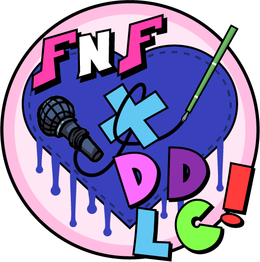

TEAM JJGAMER Presents:
# FNF X DDLC!

Hope you didn't forget!
---
FNF X DDLC, the worlds first full on, full hearted, heart pounding FNF mod featuring your favorite club of incredibly cute girls!

It's got all you could want!
- Four new songs!
- An amazing dialogue system reminicent of the game it all started with!
- And of course, our favorite four girls.

Join the club! We could use a new member.

## Credits
- [JJGamer](YT) - Artist
- [JJGamer](TW) - Musician
- [JJGamer](DIS SERV) - Coder
- [JJGamer](???) - Everything else in this little mod

(In short, I, JJGamer, made everything. **EVER.**)

## Special thanks
- [SkyMewtwo64]() - Beta tester
- [TheBoyLegendary]() - Beta tester
- [Yogi Leaf]() - Beta tester (also made some swag remixes of the songs in this mod)
- [Cyanide FS]() - Unknowingly helped me get the dokis vocals
- [Dan Salvato]() - The one, the only. If you don't know what he did I don't even know why you're here.

---

Now, enough with the thank you's. Let's get to business.

## Modding
If you're thinking of modding the game (Which you likely are if you're here.), there are a few things you'll need to know before starting.

1. This mod was made on it's own slightly modified in-house engine, JJ's Jammin' engine, made by your's truly. It's basicly the normal FNF engine but with small additions here and there, including basic Kade engine suport (Note offset, Ghost tapping, and controll remaping), and some new chart editor options.

2. The dialogue system within this mod is **HEAVILY MODDIFIED** from the original FNF's. It uses only one .png file for all the faces in a characters portrait. It does this magic with tweening, code from the health icons, and some funi math. There are also many other small but important parts that make it function the way it does, but you should be able to figure it out without to much trouble. Bug me enough about it and I'll release the dialogue system as a standalone that you can just click and drag to get going.

3. The sprites in this mod were **NOT** made in Flash but instead made in Illustrator and then ported to Flash. You can still use Flash/Animate to edit them, but it's best to use Illustrator or another vector based art program. (Both the Flash and Illustrator files are provided.)

4. If you do happen to make a mod of my mod, all I ask is that you credit me somewhere within it. (_and i mean if you wanted to slap any of my cool links above in there that would be kinda swagness_)

If you need instructions on how to mod FNF source code, check out the original [FNF source code](https://github.com/ninjamuffin99/Funkin) instruction manual.
 
 
Short, yet useful, that's all you need to know!
 
 
Have a nice weekend!

- JJGamer

